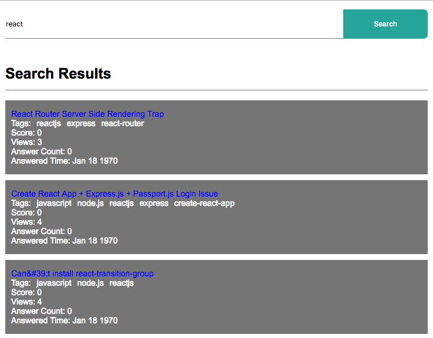
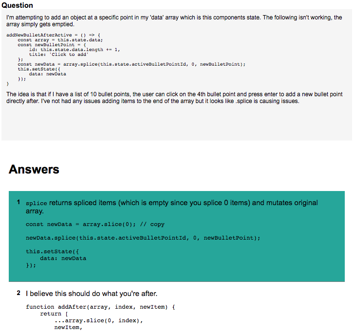
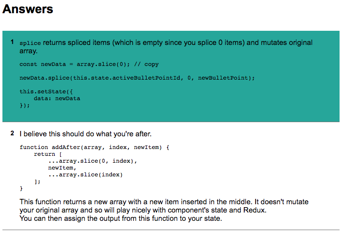

# Isomorphic React-Redux

An Isopmorphic (server rendered) react-redux based application using the stackexchange API.

## Getting Started

Clone the repository, you'll get the copy of "isomorphic-react" folder then follow the steps below:

* cd isomorphic-react
* npm install
* npm start
* quit npm start process by pressing ctrl+c (control+c in Mac)
* npm run dev
* Open the browser and type http://localhost:8080/ and press Enter

## Features

The default page shows a Search Component with an input field, type a search keyword or phrase and click the Search button. This action triggers the search functionality of Stack API and the response from the API is returned in JSON format, which is displayed as a list in the SearchList component directly below the Search Component. Each Listing displays a search title, tags, score, number of views, answer count and the creation date. On clicking the Question title in the list the page routes to the answers/:questionID page that displays the relevant question followed by the list of answers.

## Author

**Subroto Mukherjee**

## Screenshots

Screenshot of Search Page including the Search List

Screenshot of Answer Page including the Question Box showing the relevant questions

Screenshot showing the accepted answer as highlighted
